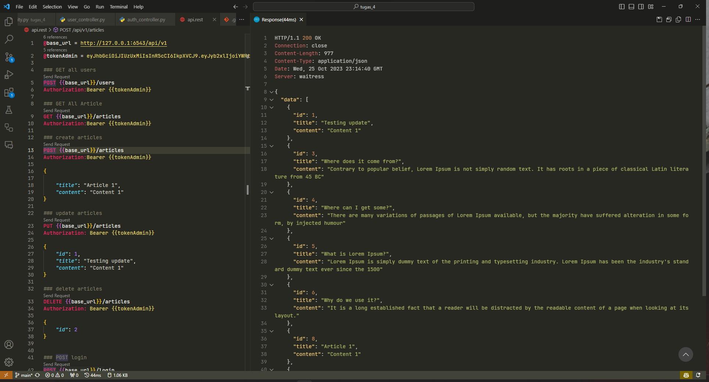

# PWL TUGAS 4

## Prequsites

- Python 3.11.3
- cookiecutter 1.7.3
- pyramid 2.0

## How to run

- Clone this repo

```bash
git clone https://github.com/maybeenang/PWL-Tugas-4.git
```

- Change directory to PWL-Tugas-4

```bash
cd PWL-Tugas-4
```

- Start virtual environment

```bash
python -m venv env
```

or

```bash
python3 -m venv env
```

- Activate virtual environment
- Windows

```bash
env\Scripts\activate.bat
```

- Other

```bash
idk
```

- Install dependencies

```bash
pip install -e .
```

- Activate your mysql server
- Create database

```bash
mysql -u root -p
```

```bash
CREATE DATABASE pwl_tugas_4;
```

- Apply migration

```bash
env\Scripts\alembic -c development.ini upgrade head
```

- Seed database

```bash
env\Scripts\initialize_pwl_tugas_4_db development.ini
```

- Run server

```bash
env\Scripts\pserve development.ini
```

- Open browser and go to http://localhost:6543
- You can see list of endpoints in api.rest file

## Screenshots



## Author

- Muhammad Elang Permadani
- 120140194
